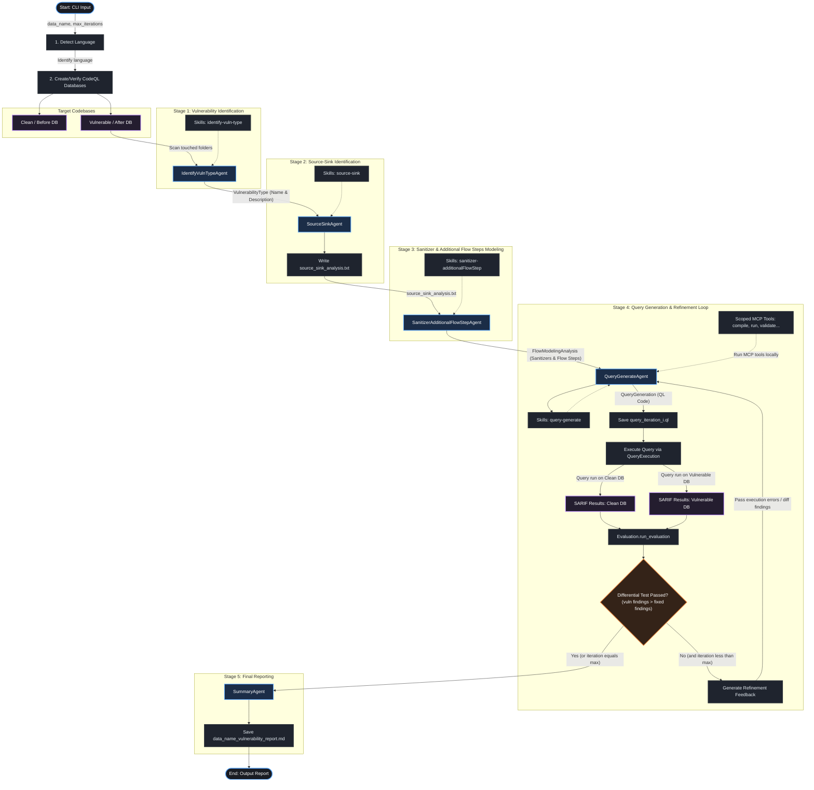

# Multi-Agent CodeQL Query Generation & Verification Workflow

This document details the architecture and step-by-step workflow of the multi-agent vulnerability verification system implemented in this repository.

---

## 1. Workflow Architecture Diagram

The diagram below maps out the orchestration pipeline from input to the final developer-friendly vulnerability report, highlighting the iterative feedback loop used to generate, execute, and refine CodeQL queries.

---

## 2. Phase-by-Phase Walkthrough

### Phase 0: Setup and Environment Detection
1. **Language Detection**: The orchestrator (`src/main.py`) scans the vulnerable codebase (`data/<data_name>/after`) for extensions (e.g., `.js`, `.py`, `.java`) to determine the target programming language.
2. **Database Initialization**: If not already present, CodeQL databases are compiled using the CodeQL CLI:
   - **Clean Database (`before_db`)**: Created from the code *before* the vulnerability-inducing commit (fixed state).
   - **Vulnerable Database (`after_db`)**: Created from the code *after* the vulnerability-inducing commit (vulnerable state).

---

### Stage 1: Identify Vulnerability Type
* **Agent**: [IdentifyVulnTypeAgent](file:///c:/deep_agent/src/agent/identify-vuln-type-agent.py)
* **Goal**: Determine the precise classification and explanation of the vulnerability from commit diffs and metadata.
* **Mechanism**:
  - Leverages the `deepagents` SDK.
  - Mounts a `FilesystemBackend` pointing to the target VIC workspace (`/vic/`) and skills (`/skills/identify-vuln-type`).
  - Outputs a structured [VulnerabilityType](file:///c:/deep_agent/src/components/structured_output.py) response containing the vulnerability's name and description.

---

### Stage 2: Identify Source-Sink Pairs
* **Agent**: [SourceSinkAgent](file:///c:/deep_agent/src/agent/source-sink-agent.py)
* **Goal**: Analyze the diffs and touched code paths to identify the top 5 most suspicious source-to-sink taint flows.
* **Mechanism**:
  - Input: Vulnerability Type.
  - Generates [SourceSinkAnalysis](file:///c:/deep_agent/src/components/structured_output.py) details.
  - Writes results to [source_sink_analysis.txt](file:///c:/deep_agent/data/<data_name>/source-sink-agent_output/source_sink_analysis.txt) so downstream agents can locate them.

---

### Stage 3: Sanitizer and Flow Step Identification
* **Agent**: [SanitizerAdditionalFlowStepAgent](file:///c:/deep_agent/src/agent/sanitizer-additionalFlowStep-agent.py)
* **Goal**: Identify sanitizers (methods neutralizing inputs) and additional flow steps (like custom model helper steps or library transitions) that standard taint tracking might miss.
* **Mechanism**:
  - Focuses on custom taint steps, validations, and conversions.
  - Returns a structured [FlowModelingAnalysis](file:///c:/deep_agent/src/components/structured_output.py) object defining clean code hints, step order, and details.

---

### Stage 4: Query Generation and Differential Refinement Loop
* **Agent**: [QueryGenerateAgent](file:///c:/deep_agent/src/agent/query-generator/query-generate-agent.py)
* **Goal**: Formulate a CodeQL query (`.ql` file) that detects the vulnerability in the vulnerable codebase but *not* in the fixed codebase.
* **Refinement Loop (up to `max_iterations`)**:
  1. **Generate**: The agent generates a query using the contextual payload (Source-Sink Pairs, Sanitizers, Taint Tracking requirements).
  2. **Save**: The query is stored as `query_iteration_i.ql`.
  3. **Execute**: The `QueryExecution` module compiles and runs the query using CodeQL CLI on both the clean and vulnerable databases, producing SARIF output files.
  4. **Evaluate**: The `Evaluation` module runs differential comparison between the SARIF signatures:
     - Extraction of signature hashes.
     - Comparing counts: `vuln_result.num_results > fixed_result.num_results`.
  5. **Check**:
     - **Success**: If it detects findings only on the vulnerable version (and zero/fewer on the clean version), the loop terminates.
     - **Failure**: If it fails to compile or fails the differential check, feedback (compilation errors or differential reports) is fed back into the next loop iteration to refine the query.

---

### Stage 5: Final Report Generation
* **Agent**: [SummaryAgent](file:///c:/deep_agent/src/agent/summary-agent.py)
* **Goal**: Compile a developer-friendly Markdown report of the vulnerability discovery and validation.
* **Mechanism**:
  - Formats an executive summary, details the taint flow analysis, documents CodeQL verification results, and provides actionable remediation guidance.
  - Outputs the report to `output/<data_name>/<data_name>_vulnerability_report.md`.
